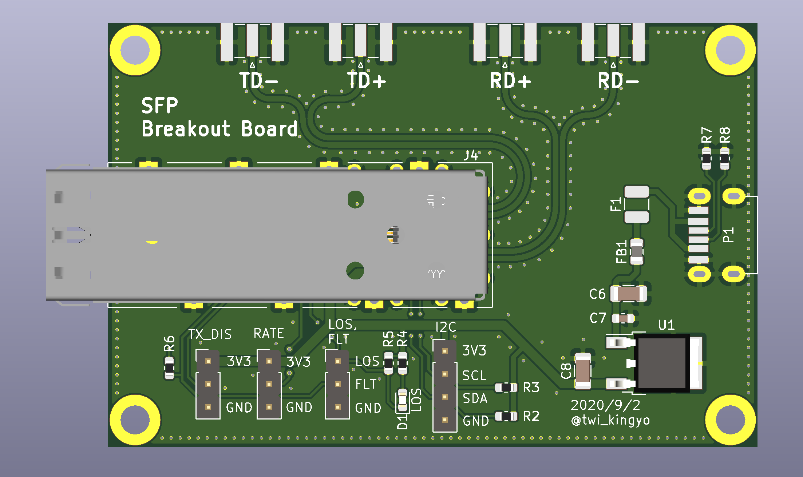
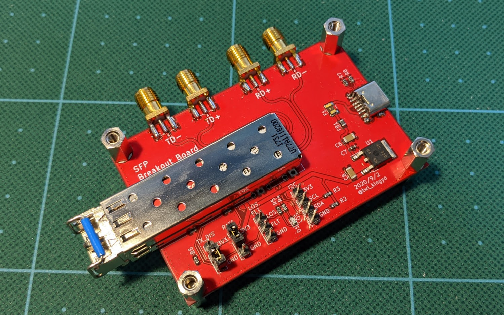

# SFP_BreakoutBoard
KiCadとプリント基板発注練習用に作成したSFP用のBreakout Boardです。身近にあるType-Cケーブルから給電可能となるように仕上げてみました。取り付け穴位置は秋月電子のCタイプ基板に揃えているためスタック可能です。  
性能をテストできる機材を持ち合わせていないので信号品質等の詳細はスペック不明ですが、SFP→SMA→SFP接続時に1Gbpsで送受信可能なことを確認しています。10Gbpsは・・・機材を入手でき次第検証予定です。  
  
  

# 開発環境
- KiCad Version 5.1.6
- RF-tools-KICAD https://github.com/easyw/RF-tools-KiCAD
